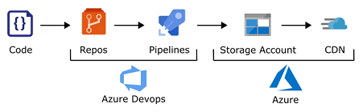
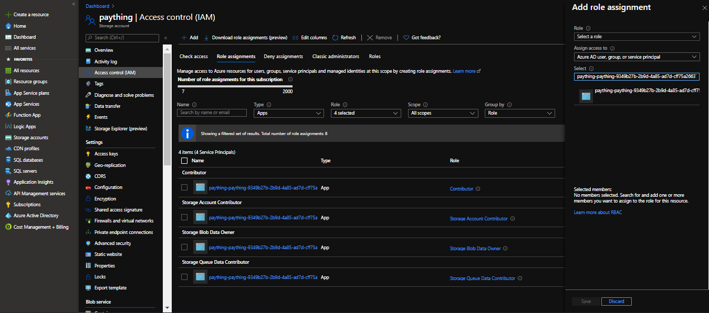

# spa-azure-pipeline

Azure devops pipeline to build an Angular 9 app and deploy it to an Azure Storage static website container.

This can be done using the Standard Microsoft CDN as explained here

https://github.com/MicrosoftDocs/azure-docs/issues/43257#issuecomment-580668444

Purge azure CDN endpoint devops extension

https://marketplace.visualstudio.com/items?itemName=fabienlavocat.FabienLavocat-PurgeAzureCDNEndpoint

References

https://docs.microsoft.com/en-us/azure/storage/blobs/storage-blob-static-website

https://www.developmomentum.com/blog/continuously_deploy_a_static_website_with_azure_pipelines.html

https://brettmckenzie.net/2020/03/23/azure-pipelines-copy-files-task-authentication-failed/

If you get an "AuthorizationPermissionMismatch" error you need to add several additional storage account roles to the enterprise app that is created by the azure pipeline as shown below

